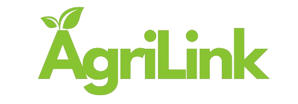

 

    
  <h3 align="center">AgriLink</h3>

  

    A transformative tool empowering farmers to sell directly to consumers while offering blockchain-based insurance for financial security.
     
     
  

 

## About The Project

AgriLink revolutionizes agricultural commerce by enabling farmers to bypass middlemen and directly connect with consumers, fostering fairer trade and higher profits. Our platform builds a vibrant community where farmers showcase their products, bridging the gap between farm and table.

🔗 Leveraging blockchain technology, AgriLink establishes a secure insurance pool, ensuring farmers receive timely payouts with minimal hassle. With blockchain-based insurance, accessing funds is streamlined, eliminating bureaucratic hurdles commonly associated with traditional banking systems.

## Built With

- Built with the power of MERN stack for seamless performance and scalability.
- Smart contracts implemented in Solidity ensure transparency and security in insurance transactions.
- Stripe integration facilitates smooth and secure payment processing for farmers and buyers alike.

## Getting Started

1. **Clone Repository:** 
   Clone the AgroInsight repository from GitHub and navigate to the project directory.

2. **Install Dependencies:** 
   Navigate to the "Frontend" and "Backend" directories and run `npm install` to install the dependencies.

3. **Set Up Environment:** 
   Configure environment variables in the `.env` file following the provided template.
   - **In the backend:** Add a `MONGO_URI`, `PORT` (assume 5000), and a `SECRET` (for JWT verification).
   - **In the frontend:** Add the `BACKEND_URI` (address and port of the backend server) and `MODEL_URI` (address and port of the python model server).

4. **Start Servers:**
   - **Starting backend:** Launch the backend server with `node server` in the "Backend" directory. If you have nodemon installed, run `nodemon server` for automatic restarts on file changes.
   - **Starting frontend:** Launch the frontend server with `npm run dev` in the "Frontend" directory.
   - **Starting the Python server:** Start the Python server containing the neural model by running `uvicorn main:app --reload --port 8000`.

5. **Explore Application:** 
   Access AgroInsight to begin exploring and customizing the application for your crop monitoring needs.

> [!NOTE]
> **Note:** Before running the project, ensure that you have all necessary dependencies installed and configured according to the instructions provided in the "Getting Started" section.

> [!TIP]
> **Tip:** For the best experience, consider running the project on a modern web browser such as Google Chrome or Mozilla Firefox.

> [!IMPORTANT]
> **Important:** Make sure to set up the environment variables correctly in the `.env` file before starting the backend and frontend servers.

> [!WARNING]
> **Warning:** Running the project without proper configuration or environment setup may result in unexpected errors or incomplete functionality.

> [!CAUTION]
> **Caution:** Be cautious when modifying sensitive configuration settings or environment variables, as incorrect changes could lead to security vulnerabilities or data loss.

## Like this project?

If you found this project helpful or interesting, please give it a star on GitHub! ⭐
